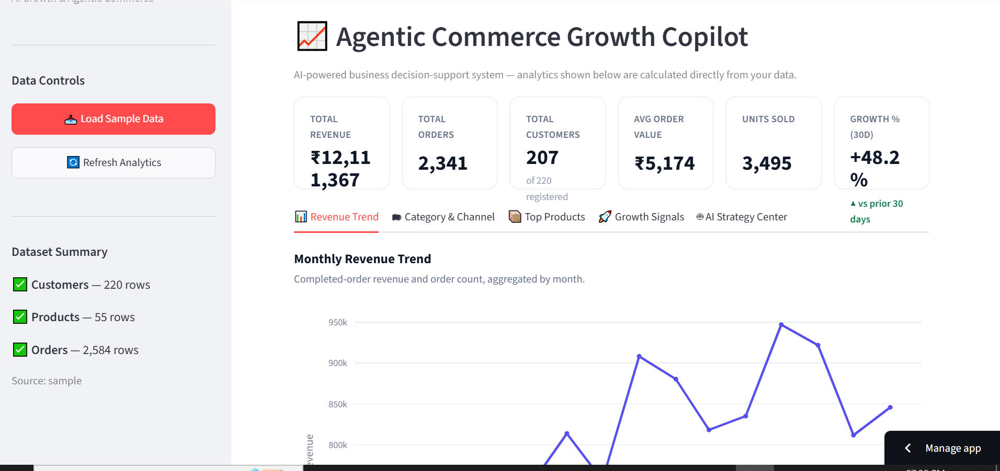
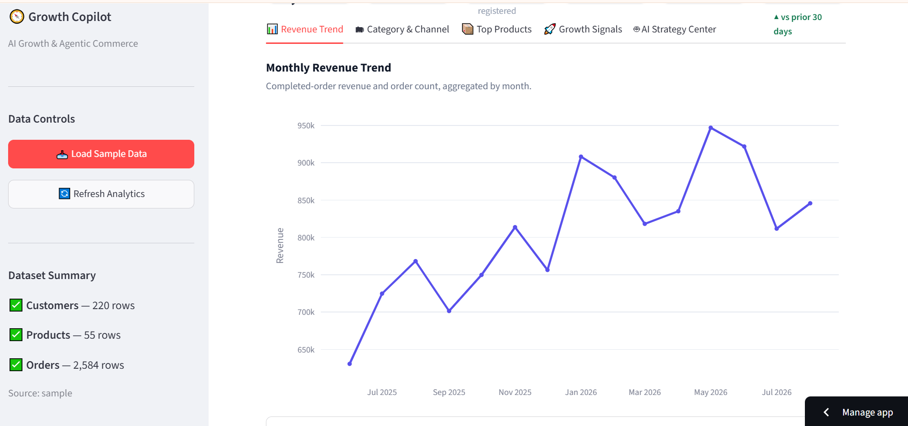
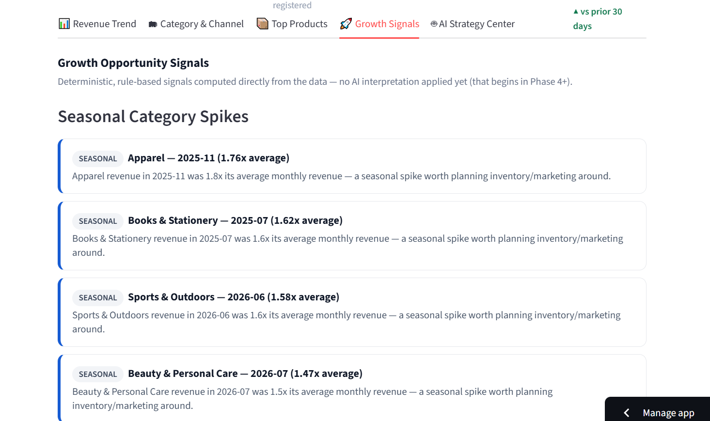
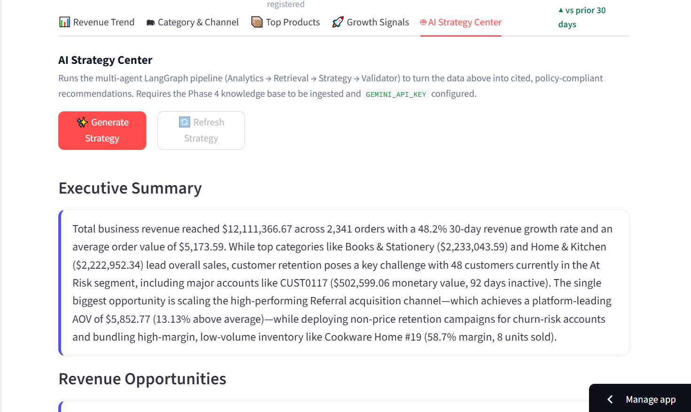

# 🚀 Agentic Commerce Growth Copilot

An AI-powered business decision-support system that transforms commerce data into actionable growth strategies using Analytics, Retrieval-Augmented Generation (RAG), Gemini, and a LangGraph multi-agent workflow.

---

## 📌 Problem Statement

Modern commerce businesses generate large amounts of transactional data every day. Traditional dashboards show metrics and charts but often fail to answer the most important question:

**"What should the business do next?"**

Business owners need actionable recommendations rather than just raw analytics.

---

## 💡 Solution

Agentic Commerce Growth Copilot combines deterministic analytics with AI-powered strategy generation.

The system analyzes business performance, retrieves relevant policy knowledge, generates strategic recommendations, and validates outputs before presenting them to users.

The result is a transparent, explainable, and actionable business intelligence platform.

---

## ✨ Key Features

### 📊 Analytics Dashboard
- Revenue Analytics
- Customer Analytics
- Product Performance Analysis
- Growth Metrics
- Interactive Visualizations

### 📈 Growth Signal Engine
- Seasonal Opportunity Detection
- Revenue Growth Signals
- Customer Retention Signals
- Product Opportunity Signals
- Rule-Based Business Insights

### 🤖 AI Strategy Center
- Multi-Agent Workflow
- AI-Generated Business Recommendations
- Executive Summary Generation
- Revenue Opportunity Analysis
- Customer Growth Strategies
- Product Optimization Recommendations
- Risk Identification
- Recommended Actions

### 🔍 RAG-Powered Knowledge Retrieval
- Policy-Aware Recommendations
- Context Grounding
- Citation-Based Responses

### ✅ Validation Layer
- Citation Validation
- Report Structure Validation
- Output Quality Checks
- Hallucination Detection

---

## 🏗️ Multi-Agent Architecture

```text
Analytics Agent
      ↓
Retrieval Agent (RAG)
      ↓
Strategy Agent (Gemini)
      ↓
Validator Agent
      ↓
Final Strategy Report
```

### Analytics Agent
Processes commerce data and generates business insights.

### Retrieval Agent
Retrieves relevant policy and knowledge-base context using ChromaDB.

### Strategy Agent
Uses Gemini to generate strategic recommendations grounded in retrieved knowledge.

### Validator Agent
Validates report completeness, structure, and citations before presenting results.

---

## 🛠️ Tech Stack

### Frontend
- Streamlit

### Data Processing
- Pandas
- NumPy

### Visualization
- Plotly

### AI & Agents
- LangGraph
- Google Gemini

### Knowledge Base
- ChromaDB
- RAG

### Backend
- Python

---

## 📸 Screenshots

### Dashboard Overview



### Revenue Analytics



### Growth Signals



### AI Strategy Center



---

## 🎥 Demo Video

YouTube Demo:

https://youtu.be/fU32EqSMTKI?si=zXBg_ThTssMruKL1

---

## 🌐 Live Demo

Streamlit App:

https://agentic-commerce-growth-copilot-fjugxhaydzbmndyxws39kf.streamlit.app/

---

## ⚙️ Installation

### Clone Repository

```bash
git clone https://github.com/your-username/agentic-commerce-growth-copilot.git
cd agentic-commerce-growth-copilot
```

### Create Virtual Environment

```bash
python -m venv .venv
```

### Activate Environment

Windows:

```bash
.venv\Scripts\activate
```

### Install Dependencies

```bash
pip install -r requirements.txt
```

### Configure Environment Variables

Create a `.env` file:

```env
GEMINI_API_KEY=your_api_key_here
```

### Run Application

```bash
streamlit run app.py
```

---

## 📈 Future Enhancements

- Merchant-specific personalization
- Real-time analytics
- Predictive forecasting
- Automated strategy execution
- Multi-LLM support
- Advanced business simulation engine

---

## 🎯 Impact

Instead of simply displaying business data, Agentic Commerce Growth Copilot helps businesses understand:

- What is happening?
- Why is it happening?
- What should be done next?

This transforms traditional analytics into actionable AI-powered business strategy.

---

## 👩‍💻 Author

**Haritha Kurada**

B.Tech CSE

Dadi Institute of Engineering & Technology

GitHub: https://github.com/haritha4538